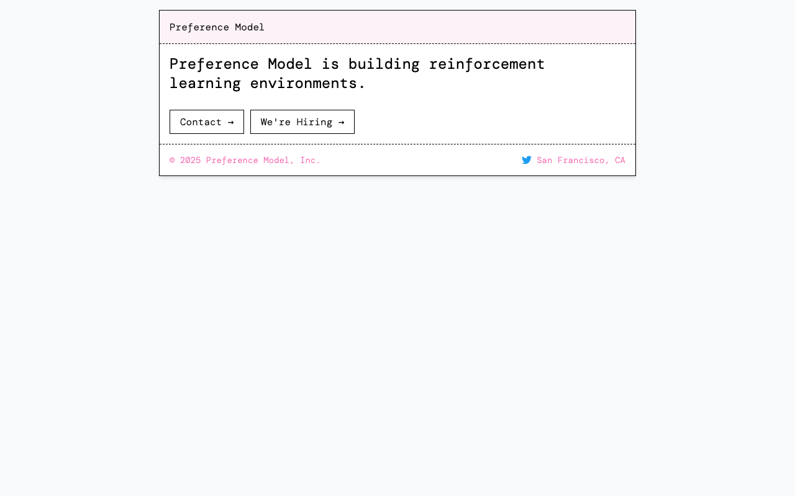
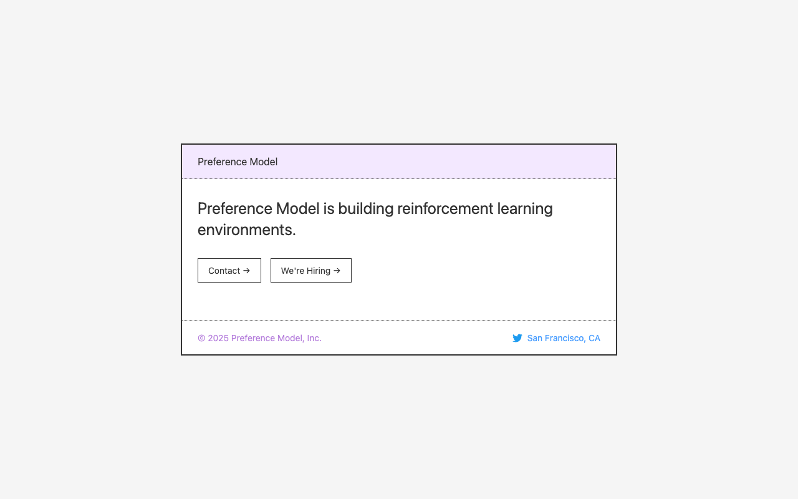

# WebRL

An RL environment where an LLM receives a screenshot of a website (plus its image assets) and must recreate the page as a single HTML file. The environment scores the output based on visual similarity (SSIM + LPIPS) and structural anti-cheat heuristics.

## Prerequisites

- Python 3.11+
- [uv](https://docs.astral.sh/uv/)

## Setup

Install dependencies:

```sh
uv sync
```

Install Playwright browsers:

```sh
uv run playwright install chromium
```

## Usage

All commands are run via `uv run python -m webrl`.

### Capture a sample from a URL

```sh
uv run python -m webrl capture https://example.com data/example --difficulty medium
```

This screenshots the page at 1280x800 and downloads its image assets into `data/example/`.

### Run a single episode against Claude

```sh
uv run python -m webrl run data/ --sample example
```

Uses the Claude Agent SDK to set up the environment and let Claude drive the tool-use loop to recreate the target screenshot. Authenticates via your Claude subscription (or `ANTHROPIC_API_KEY` env var). Prints the final score, steps used, and elapsed time.

Options:

| Flag                 | Default                    | Description                              |
| -------------------- | -------------------------- | ---------------------------------------- |
| `--sample ID`        | random                     | Sample ID to run                         |
| `--model MODEL`      | `claude-sonnet-4-20250514` | Model name                               |
| `--max-steps N`      | 20                         | Maximum tool calls per episode            |
| `--preview-budget N` | 10                         | Maximum preview renders                  |
| `--max-turns N`      | max-steps + 5              | Max conversation turns (safety cap)      |

### Run a batch of episodes

```sh
uv run python -m webrl batch data/ --output results.json
```

Runs all samples in the dataset sequentially and prints per-episode results plus summary statistics (mean/min/max score). Use `--output` to write detailed results to a JSON file.

Options are the same as `run`, plus:

| Flag               | Default | Description                |
| ------------------ | ------- | -------------------------- |
| `--samples ID ...` | all     | Specific sample IDs to run |
| `--output FILE`    | none    | Write JSON results to file |

### Score an output HTML against a target

```sh
uv run python -m webrl score data/example/screenshot.png data/example/output/index.html
```

Prints the combined score (0-1), SSIM, LPIPS, and anti-cheat results.

### Set up an episode (debug)

```sh
uv run python -m webrl episode data/
```

Picks a random sample from the dataset, sets up the environment, and prints the prompt and asset list. Useful for inspecting what the LLM would see without making API calls.

## Example

Running an episode on the `preferencemodel` sample:

```sh
uv run python -m webrl run data/ --sample preferencemodel --save-dir results/
```

| Target | Rendered |
|--------|----------|
|  |  |

Output:

```
Sample:      preferencemodel
Score:       0.7370
SSIM:        0.8982
LPIPS:       0.3320
Anti-cheat:  PASSED
Steps:       3
Turns:       36
Time:        127.9s
```

- **Score** — final reward: `0.3 × SSIM + 0.7 × (1 - LPIPS)`
- **SSIM** — structural similarity (higher = better)
- **LPIPS** — perceptual distance (lower = better)
- **Anti-cheat** — structural validation to prevent reward hacking

## Data Format

Each sample is a directory containing a target screenshot and image assets:

```
data/
└── sample-name/
    ├── screenshot.png    # target screenshot (1280x800)
    └── assets/           # image assets from the original site
        ├── logo.png
        └── ...
```

## Project Structure

```
webrl/
├── __init__.py
├── __main__.py       # CLI entry point
├── runner.py         # LLM runner (connects environment to Claude Agent SDK)
├── environment.py    # RL environment (episode setup, step, score)
├── renderer.py       # headless browser rendering via Playwright
├── judge.py          # scoring (visual similarity + anti-cheat gate)
├── similarity.py     # SSIM and LPIPS image comparison
├── anti_cheat.py     # structural checks to prevent reward hacking
├── tools.py          # tools exposed to the LLM during episodes
├── prompt.py         # system prompt construction
└── data.py           # sample capture and dataset loading
```
